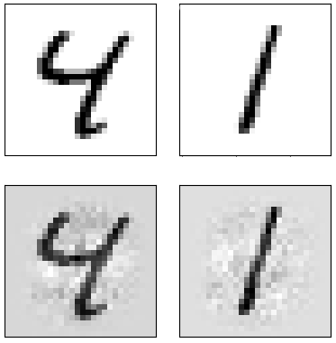

# Solving Saddle Point Problems When One of the Variables Has a Small Dimension
Implementation of the method for solving saddle point problems. Experiments in application to adversarial attacks.

**Dataset**: [MNIST](http://yann.lecun.com/exdb/mnist/)

**Models**: SVM and LogReg trained on the first half of the train set + SVM and LogReg trained on the second half of the train set.

**Robust adversarial attack** tries to construct an example to mislead all models simultaneously.

Two of the successful adversarial examples:

Original (top) and adversarial (bottom) examples
